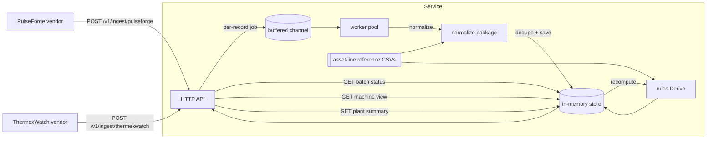

# Aurik Equipment Monitor

A small backend service for an industrial equipment monitoring platform. It
ingests machine sensor/alert data from two vendors with different schemas,
normalizes it into one canonical internal representation, processes it
asynchronously, and serves a derived **machine operational attention view**
plus plant-level summaries.

Built for the Aurik Technologies Tech Lead take-home assessment. Deliberately
kept small: two vendors (not three), in-memory storage (not a database), no
auth. See [Scope & trade-offs](#scope--trade-offs) for why, and
[DESIGN_NOTE.md](DESIGN_NOTE.md) for the reasoning behind the less obvious
decisions.

## Architecture



**Request path (synchronous):** the HTTP handler reads a vendor batch,
splits it into individual raw records, creates a `Batch` with one pending
outcome slot per record, and enqueues a job per record. It responds `202`
with a `batch_id` as soon as the envelope itself parses -- it does not wait
for normalization.

**Processing path (asynchronous):** a fixed pool of worker goroutines drains
the job queue. For each job: normalize the raw record into the canonical
schema (or reject it, if it's unusable) → check it isn't a duplicate → save
it → recompute that machine's derived view. Every step updates the record's
outcome, visible via the batch status endpoint.

## Quick start

### Docker Compose (preferred)

```bash
docker compose up --build
```

The API is now at `http://localhost:8080`.

### Locally, without Docker

Requires Go 1.22+.

```bash
go run ./cmd/server
# listens on :8080; set PORT to change it
```

### Running the tests

```bash
go test ./...          # all packages
go test ./... -race     # with the race detector (worker pool is concurrent)
```

36 tests across normalization, the rules engine, the store, the worker pool,
and full HTTP integration (real store + real worker pool behind
`httptest.Server`).

## API

All endpoints are prefixed `/v1` except health. Every response is JSON.

A ready-to-import Postman collection is at
[Aurik-Equipment-Monitor.postman_collection.json](Aurik-Equipment-Monitor.postman_collection.json)
-- 15 requests covering every endpoint below, including the malformed/
duplicate/rejected edge cases, each with an inline test assertion. Import
it, set the `base_url` collection variable if you're not on `:8080`, and
run top to bottom.

| Method & path | Purpose |
|---|---|
| `GET /healthz` | Liveness check. |
| `POST /v1/ingest/pulseforge` | Accepts one PulseForge batch envelope. |
| `POST /v1/ingest/thermexwatch` | Accepts one ThermexWatch batch envelope. |
| `GET /v1/ingest/batches/{batchID}` | Per-record processing status for a batch. |
| `GET /v1/machines/{machineID}` | Derived operational attention view for one machine. |
| `GET /v1/machines?plant_id=&status=` | All machines' views, optionally filtered. |
| `GET /v1/plants/{plantID}/summary` | Plant/line rollup: counts by status, critical machines, stale machines. |

### Ingest a PulseForge batch

```bash
curl -s -X POST localhost:8080/v1/ingest/pulseforge \
  -H 'Content-Type: application/json' \
  -d '{
    "vendor": "PulseForge", "plant_id": "PLANT_01", "batch_generated_at": "2026-04-18T08:05:00Z",
    "events": [{
      "event_id": "PF-1001", "machine_id": "EQ-001", "line_id": "LINE-A",
      "event_time": "2026-04-18T07:59:12Z", "event_type": "HIGH_VIBRATION", "severity": "high",
      "vibration_mm_s": 11.8, "temperature_c": 83.2, "machine_state": "running",
      "sensor_health": 0.91, "vendor_confidence": 0.87
    }]
  }'
# -> 202 {"batch_id":"batch_...","status":"queued","status_url":"/v1/ingest/batches/batch_..."}
```

### Check what happened to it

```bash
curl -s localhost:8080/v1/ingest/batches/batch_XXXXXXXXXXXX
```

### Read the derived view

```bash
curl -s localhost:8080/v1/machines/EQ-001
curl -s localhost:8080/v1/plants/PLANT_01/summary
```

The request/response envelope shapes match `vendor_api_samples/pulseforge_sample.json`
and `thermexwatch_sample.json` from the assessment assets exactly (post the
inner object directly as the body -- the assets' `happy_path.json` and
edge-case files nest that same shape under a `"pulseforge"`/`"thermexwatch"`
key purely for bundling multiple vendors in one local test file; pull the
relevant key out with `jq` before posting it, e.g.
`jq .pulseforge happy_path.json | curl -d @- ...`).

## Canonical schema & the machine view

Every vendor record normalizes to `domain.NormalizedEvent`
([internal/domain/types.go](internal/domain/types.go)): machine/plant/line
id (resolved against reference data, not trusted from the vendor), a UTC
`event_time`, the vendor's own event/alert code (kept, for traceability), a
normalized `attention_level` (none/low/medium/high/critical -- the one
severity scale every vendor's own severity/level field is mapped onto), and
whichever physical signals the vendor reported.

`GET /v1/machines/{id}` returns `domain.MachineView`, matching the fields
requested in `expected_output_context.md`:

```json
{
  "machine_id": "EQ-001", "plant_id": "PLANT_01", "line_id": "LINE-A",
  "derived_status": "needs_attention",
  "needs_attention": true,
  "attention_level": "high",
  "reason_codes": ["PULSEFORGE_HIGH_VIBRATION_HIGH", "VIBRATION_ABOVE_RATED_MAX"],
  "latest_relevant_event_time": "2026-04-18T07:59:12Z",
  "processing_status": "stale",
  "last_processed_at": "2026-09-17T05:25:21Z",
  "source_event_refs": [{"vendor": "pulseforge", "source_event_id": "PF-1001"}],
  "latest_signals": [{"vendor": "pulseforge", "event_type": "HIGH_VIBRATION", "event_time": "...", "attention_level": "high"}]
}
```

How it's computed (deterministic, no ML -- see [DESIGN_NOTE.md](DESIGN_NOTE.md)
for the full reasoning): take each vendor's latest event *by event_time*
(not arrival order), take the worst `attention_level` across vendors,
cross-check against the machine's rated thresholds for additional reason
codes, and layer the asset's maintenance status on top as the final
`derived_status`.

## Scope & trade-offs

Kept deliberately small, per the brief's "do not over-engineer" guidance.
What's in vs. out, and why:

| Included | Why |
|---|---|
| 2 vendors (PulseForge, ThermexWatch) | Meets the brief's stated minimum; enough schema divergence (units, timestamp formats, severity scales, camelCase vs. snake_case) to demonstrate real normalization. |
| In-memory store | No DB setup/migrations needed to run or review this. Thread-safe, but data is lost on restart. |
| Async worker pool (goroutines + channel) | Real concurrency, real retry/dead-letter semantics, no external broker to run. |
| Per-record accept/reject, not whole-batch | One malformed record in a batch doesn't sink the rest -- this is the actual point of the exercise. |
| No auth | Explicitly optional per the brief ("if you choose to include it"); would add API-key or mTLS auth in production. |

| Deliberately excluded | What I'd do instead in production |
|---|---|
| A third vendor (MaintaFlow) | Same normalization pattern extends directly; skipped to keep the codebase small enough to walk through in an interview. |
| Persistent storage | Swap `store.Store`'s map-backed implementation for a Postgres-backed one behind the same method set used by `httpapi` and `worker` (both already consume it via small interfaces, not the concrete type). |
| API versioning beyond a `/v1` prefix | Add a version negotiation strategy once there's a second version to negotiate. |
| Real dead-letter queue / durable retry | The in-memory store never actually fails a write, so this project's retry path is only exercised by a fault-injecting test double ([internal/worker/worker_test.go](internal/worker/worker_test.go)). A production system would persist failed jobs and retry across restarts. |
| Rate limiting / backpressure beyond a blocking channel | `Pool.Submit` blocks if the queue is full; production would return `503` instead. |
| Distributed processing | A single process with an in-memory queue is adequate at this scale; the brief explicitly asks for "a simple and well-reasoned approach," not a distributed system. |

## Limitations

- **Data loss on restart.** Everything lives in memory. Acceptable for a
  review/demo; not for production.
- **Freshness window is a fixed 2 hours,** not configurable, not
  machine/criticality-aware. A `high`-criticality press probably deserves a
  tighter staleness threshold than a `low`-criticality packager.
- **No pagination** on `GET /v1/machines` -- fine at 8 machines, not at
  8,000.
- **Single-process.** No leader election, no horizontal scaling story; the
  worker pool and store both assume one process.
- **Vibration is not cross-vendor-comparable** by design (see DESIGN_NOTE) --
  a consumer wanting a single normalized vibration number across vendors
  would need additional vendor calibration data this assessment doesn't
  provide.

## What I'd do next for production

1. Swap the in-memory store for Postgres (or similar); the store's method
   set is already the only thing `httpapi` and `worker` depend on, so this
   is a contained change.
2. Persist the job queue (or move to a real message broker) so retries and
   dead-letters survive a restart.
3. Add API-key or mTLS authentication on the ingestion endpoints, and rate
   limiting per vendor.
4. Make the freshness window and attention thresholds configurable per
   machine criticality rather than one fixed constant.
5. Add structured logging/tracing and basic metrics (queue depth, per-vendor
   reject rate, processing latency) -- the things you'd actually want paged
   on.
6. Add OpenAPI generation from the handler layer (currently hand-documented
   in this README) so the contract can't drift from the implementation.

## AI usage disclosure

Built with Claude Code (Anthropic). It wrote the initial implementation of
every layer (normalization, rules engine, store, worker pool, HTTP API) and
the tests, from a scope and set of validation-policy decisions worked out
in conversation first (which fields are hard-reject vs. soft-normalize,
the worst-wins aggregation approach, event-time- vs. arrival-order-based
recency, why vibration units aren't cross-vendor-converted, the in-memory
vs. database trade-off, and the two-vendor/no-auth minimal scope). All of
it was reviewed, built, and test-run locally against the assessment's
sample and edge-case data before being committed; nothing here is
unreviewed generated output.
